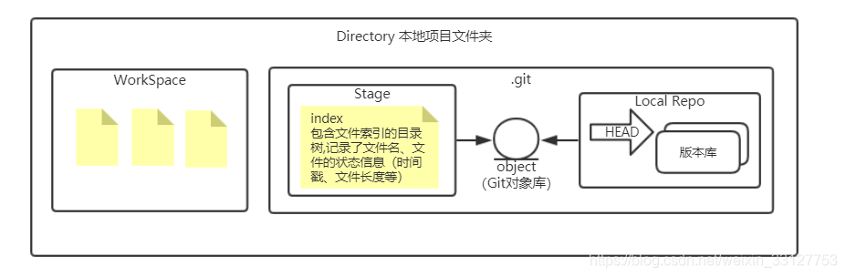

# git

> + **Workspace 工作区**
> + **Index / Stage 暂存区**
> + **Repository 仓库区(本地仓库)**
> + **Remote 远程仓库**

## ssh agent详解
> ssh agent是一个密钥管理器，用来管理一个多个密钥，并为其他需要使用 ssh key 的程序提供代理。

- **添加密钥ssh-add**
>运行 ssh-add 时， 如果提示 “Could not open a connection to your authentication agent.” 说明你的ssh-agent并没有运行；使用下面的命令运行 ssh agent，再使用ssh-add命令添加你的 ssh key。

` shell `

    # 先启动，再运行
    # macOS/Linux
    $ eval `ssh-agent`
    ssh-add ~/.ssh/other_id_rsa

    # 在Windows中的git-bash中
    $ eval $(ssh-agent)
    ssh-add ~/.ssh/other_id_rsa